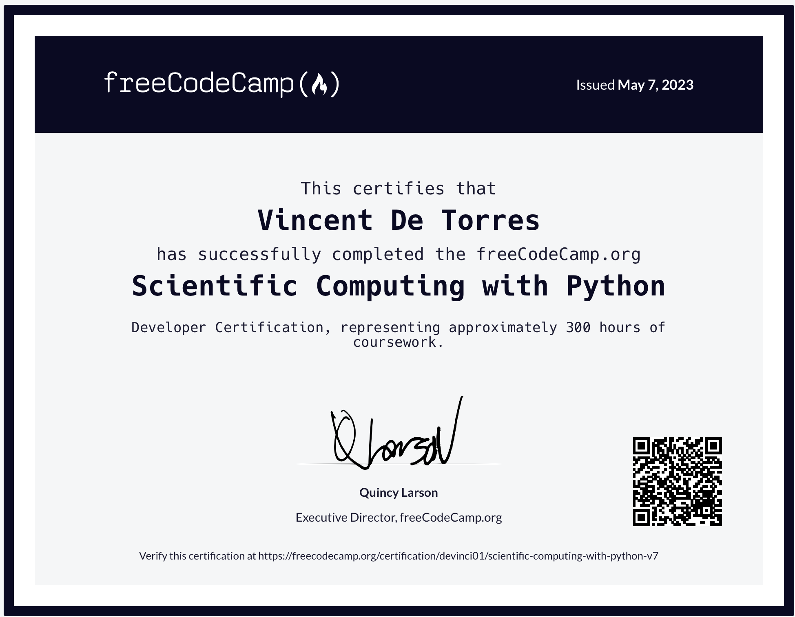

# FreeCodeCamp Python

## About this project

[freeCodeCamp.org](https://www.freecodecamp.org/certification/devinci01/scientific-computing-with-python-v7)

This project is part of the freeCodeCamp Python curriculum, and consists of completing five different tasks related to Python programming. The tasks involve creating different applications, such as a budget app, a time calculator, and a polygon area calculator, among others. The goal of this project is to help learners practice their Python skills and gain experience in solving real-world problems through programming.